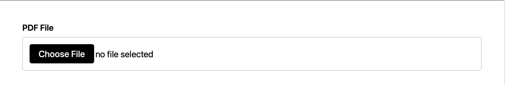

# PDF Extractor & Analyzer

A simple web application that extracts text from PDF files and provides AI-powered analysis.

## Quick Start Guide

### Step 1: Get the Code

**Fork or Download:**
- Fork: Go to https://github.com/Shriiii01/PDF_EXTRACTOR and click "Fork"
- Download: Click "Code" → "Download ZIP" and extract it

### Step 2: Open Terminal

Navigate to the project folder:
```bash
cd PDF_EXTRACTOR
```

### Step 3: Create Virtual Environment

```bash
python3 -m venv venv
```
**Windows:** `python -m venv venv`

### Step 4: Activate Virtual Environment

**macOS/Linux:**
```bash
source venv/bin/activate
```

**Windows:**
```bash
venv\Scripts\activate
```

You should see `(venv)` in your terminal.

### Step 5: Install Requirements

```bash
pip install --upgrade pip
pip install -r requirements.txt
```

### Step 6: Set Up API Key

1. Create a file named `.env` in the project folder
2. Add: `OPENAI_API_KEY=your_api_key_here`
3. Replace `your_api_key_here` with your actual key from https://platform.openai.com/api-keys

### Step 7: Start the Server

```bash
uvicorn main:app --reload --host 0.0.0.0 --port 8000
```

You should see: `INFO: Uvicorn running on http://0.0.0.0:8000`

### Step 8: Open in Browser

Go to: `http://localhost:8000`

## How to Use

### 1. Upload PDF
Click "Choose File" and select your PDF.

### 2. Enter Procedure
Type what you're analyzing in the "Procedure" field:
- Example: "Vacation Singapore" or "Medical Procedure"


### 3. Enter Insurance Payer
Type relevant information in the "Insurance Payer" field:
- Example: "Travel Guide" or "Insurance Company"


### 4. Process PDF
Click the "Process PDF" button to analyze your document.


Results will appear showing:
- AI Analysis
- Extracted Text
- Input Details

### Example Result



## Stop Server

Press `Ctrl+C` in the terminal.

## Troubleshooting

**"ModuleNotFoundError"**
- Activate virtual environment: `source venv/bin/activate`
- Install: `pip install -r requirements.txt`

**"OpenAI API key not configured"**
- Check `.env` file exists
- Verify API key is correct
- Restart server

**Port 8000 in use**
- Use: `uvicorn main:app --reload --port 8001`
- Access: `http://localhost:8001`

## Requirements

- Python 3.8+
- OpenAI API key
- Internet connection

## Notes

- PDFs processed in memory (not saved)
- OpenAI API usage incurs costs
- Runs locally on your computer
