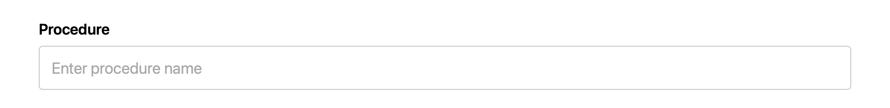

# PDF Extractor & Analyzer

A simple web application that extracts text from PDF files and provides AI-powered analysis.

## Quick Start Guide

### Step 1: Get the Code

**Option A: Fork the Repository**
1. Go to https://github.com/Shriiii01/PDF_EXTRACTOR
2. Click the "Fork" button to create your own copy

**Option B: Download**
1. Click the green "Code" button
2. Select "Download ZIP"
3. Extract the ZIP file to your desired location


### Step 2: Open Terminal/Command Prompt

Navigate to the project folder:

```bash
cd PDF_EXTRACTOR
```

### Step 3: Create Virtual Environment

```bash
python3 -m venv venv
```

**On Windows:**
```bash
python -m venv venv
```

### Step 4: Activate Virtual Environment

**On macOS/Linux:**
```bash
source venv/bin/activate
```

**On Windows:**
```bash
venv\Scripts\activate
```

You should see `(venv)` in your terminal prompt.

### Step 5: Install Requirements

```bash
pip install --upgrade pip
pip install -r requirements.txt
```

This installs all necessary packages (FastAPI, OpenAI, PyPDF2, etc.).

### Step 6: Set Up API Key

1. Create a file named `.env` in the project folder
2. Add your OpenAI API key:

```
OPENAI_API_KEY=your_api_key_here
```

Replace `your_api_key_here` with your actual OpenAI API key from https://platform.openai.com/api-keys

### Step 7: Start the Server

```bash
uvicorn main:app --reload --host 0.0.0.0 --port 8000
```

You should see:
```
INFO: Uvicorn running on http://0.0.0.0:8000
```

### Step 8: Open in Browser

Open your web browser and go to:

```
http://localhost:8000
```

## How to Use the Application

### Step 1: Upload PDF

Click "Choose File" and select your PDF file.

### Step 2: Enter Procedure

In the "Procedure" field, enter what you're analyzing. For example:
- "Vacation Singapore"
- "Medical Procedure"
- "Business Trip"



### Step 3: Enter Insurance Payer

In the "Insurance Payer" field, enter relevant information. For example:
- "Travel Guide"
- "Insurance Company Name"
- "Corporate Travel"


### Step 4: Process PDF

Click the "Process PDF" button to analyze your document.


The application will:
- Extract text from your PDF
- Send it to OpenAI for AI analysis
- Display results in clear sections

## Stopping the Server

Press `Ctrl+C` in the terminal to stop the server.

## Troubleshooting

**"ModuleNotFoundError"**
- Make sure virtual environment is activated
- Run: `pip install -r requirements.txt`

**"OpenAI API key not configured"**
- Check that `.env` file exists in project folder
- Verify API key is correct (no extra spaces)
- Restart the server

**Port 8000 already in use**
- Use a different port: `uvicorn main:app --reload --port 8001`
- Access at `http://localhost:8001`

## Requirements

- Python 3.8 or higher
- OpenAI API key
- Internet connection

## Notes

- PDFs are processed in memory (not saved)
- OpenAI API usage incurs costs based on usage
- App runs locally on your computer

## Support

For issues, check:
1. Python version: `python3 --version` (should be 3.8+)
2. Virtual environment is activated
3. All requirements installed
4. `.env` file exists with valid API key
